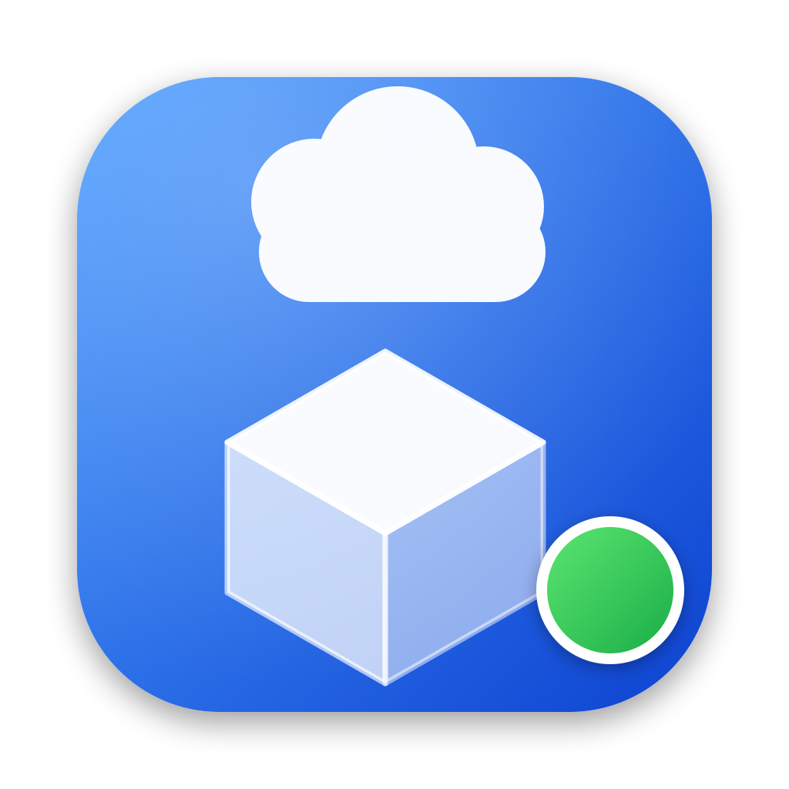

# Sbx Monitor

<p align="center">
  
</p>

<p align="center">
  
  
  
</p>

A native macOS app that monitors **Docker Sandboxes cloud sandboxes** (`sbx --cloud`).
It lives in your menu bar as a tray indicator and also opens a full desktop window
with a built-in terminal.

<p align="center">
  
</p>

## What it shows

Data comes from `sbx --cloud ls --json` (polled on a timer):

- Sandbox **name, agent, status** (running / stopped) with a colored indicator
- **Time-to-live countdown** to each sandbox's expiry (turns yellow → orange → red as it approaches)
- **Resources** (vCPU / memory), image, sandbox ID, created/expiry timestamps
- **Exposed ports** with their public HTTPS URLs (open / copy / unpublish)

## What it can do

- **Tray indicator**: icon shows the sandbox count and fills when any sandbox is running; click for a detail popover.
- **Desktop window**: sidebar list + detail pane.
- **Built-in terminal**: opens an embedded terminal window per sandbox. Choose:
  - **Sandbox shell** → `sbx --cloud exec -it <id> bash`
  - **Agent session** → `sbx --cloud attach <id>` (interactive agent TUI)
  - **Host shell** → a login shell on this Mac
- **Extend TTL** by +15m / +30m / +1h / +2h.
- **Stop** and **Remove** (with confirmation).
- **Notifications** when a sandbox is about to expire.
- Auto-refresh interval and `sbx` path override in **Settings**.

Open a terminal from the dashboard toolbar, the detail pane, the menu-bar row
(terminal icon), or its context menu.

### Terminal implementation

The built-in terminal uses [SwiftTerm](https://github.com/migueldeicaza/SwiftTerm)
(a real PTY-backed terminal emulator, so interactive TUIs work — not a fake
output pane or AppleScript). It is pinned to `1.10.x`; the newer 1.12+ releases
require compiling a Metal shader with `metal`, which fails to build under the
current Xcode SDK here.


## Requirements

- macOS 14+
- Swift 5.9+ toolchain (Xcode command line tools)
- The `sbx` CLI installed and signed in (`sbx login`), with cloud access enabled

## Launch at login

Enable **Settings → General → Launch at login**. The app registers itself via
`SMAppService` (no helper bundle or LaunchAgent file needed). If macOS reports
that approval is required, use **Open Login Items** and allow it in
System Settings → General → Login Items.

Because the login item stores the app's path, install to a stable location:

```sh
make install     # builds and copies to /Applications, then launches
make uninstall   # quit + remove (also clears the login item)
```

## Build & run

```sh
make app        # builds dist/SbxMonitor.app and opens it
make icon       # regenerate Resources/AppIcon.icns from Tools/make_icon.swift
```

Or manually:

```sh
./build_app.sh
open dist/SbxMonitor.app
```

For a quick compile check:

```sh
swift build
```

Diagnostics (no GUI):

```sh
.build/debug/SbxMonitor --dump             # print the live cloud sandbox list as JSON
.build/debug/SbxMonitor --terminal-smoke   # verify the embedded PTY terminal runs a process
```

## Notes

- The app shells out to `sbx` using absolute binary paths (`/opt/homebrew/bin/sbx`, …) and a login-shell
  fallback, because GUI apps don't inherit your shell `PATH`. Override the path in **Settings**.
- Only the **cloud** backend is monitored (`sbx --cloud`); local sandboxes are out of scope.
- Destructive actions require confirmation. Nothing is changed unless you click a control.
